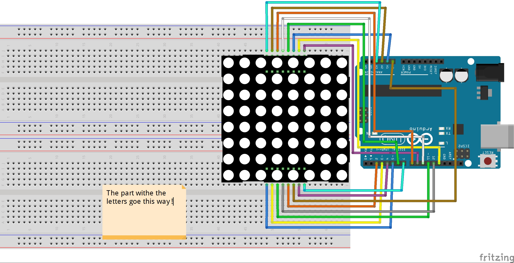

#### Este é o código que está dentro do Arduino.
Código do servidor está [neste repo](https://github.com/makerspaceafa/webled-server).  

## Instalação  
- Fazer clone / descarregar este repo.
- Abrir código no [Arduino IDE](https://www.arduino.cc/en/software)
- No IDE, configurar:
  - Tools > Board: escolher "Arduino Uno"
  - Tools > Port: escolher a porta correta
- Fazer o upload do sketch

#### Atenção, para fazer o upload **NÃO** pode haver nada entre os pins GND e RST (remover o condensador se lá estiver).

## Wiring  

